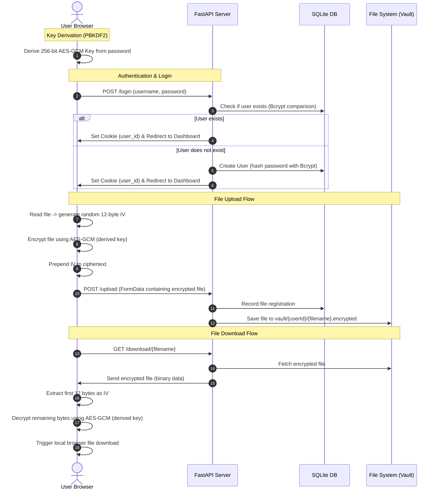

# 🔐 Quantum Safe Storage

A secure, zero-knowledge, client-side encrypted cloud storage proof-of-concept application built with a **Python (FastAPI)** backend and a **Vanilla JavaScript (Web Crypto API)** frontend.

This project demonstrates a security-first cloud storage model where file encryption and decryption are executed entirely in the user's web browser. The server only sees encrypted blobs and has zero knowledge of the encryption keys or the contents of the files stored.

---

## 🛡️ Security Architecture

The core philosophy of this application is **Zero-Knowledge**. The server handles user management, database indexing, and hosting encrypted file blobs, but never accesses raw file content or encryption keys.



### 🗝️ Key Derivation & Encryption Details
1. **Key Derivation (PBKDF2)**:
   - When the password is submitted on the login form, the client derives a 256-bit AES key using PBKDF2.
   - It runs **99,999 iterations** of **SHA-256** using a static salt (`tmpSalt`).
   - The derived key is stored in memory (`window.encryptionKey`) and is never sent to the network.
2. **Encryption (AES-GCM)**:
   - During file upload, a cryptographically secure random 12-byte **Initialization Vector (IV)** is generated.
   - The file's binary stream is encrypted using **AES-GCM (256-bit)** with the derived key and the generated IV.
   - The IV is prepended to the ciphertext, creating a single file payload uploaded to the server.
3. **Decryption**:
   - Upon download, the client reads the first 12 bytes of the file stream as the IV and the remaining bytes as ciphertext.
   - It decrypts the ciphertext using the same in-memory key and the extracted IV, restoring the original file.

---

## ✨ Features

- 🔒 **Zero-Knowledge Encryption**: All cryptographic operations (encryption, decryption, and key derivation) occur locally in the user's browser.
- 🔑 **Strong Local Key Derivation**: High-iteration PBKDF2 keeps keys secure from server-side exposure.
- ⚡ **FastAPI Backend**: A lightweight and fast server serving HTML responses and processing chunked multipart file uploads.
- 📦 **Isolated User Vaults**: Files are stored in separate, ID-based directories inside the storage vault.
- 💾 **SQLite Integration**: Simple user and file indexing database using secure, automatic salted Bcrypt hashing on user passwords.

---

## 📁 Project Structure

```
quantumSafeStorage/
├── src/
│   ├── backend/
│   │   ├── __init__.py
│   │   ├── database.py       # User registration, authentication (bcrypt), and SQL file registry
│   │   ├── fileManager.py    # Directory management for individual user vault folders
│   │   └── main.py           # FastAPI entry point, routers for auth, template routing, upload & download
│   └── frontend/
│       ├── index.html        # Login/Register UI & client-side key derivation script
│       └── dashboard.html    # User file manager UI with client-side encryption and decryption
├── vault/                    # Server-side directory storing encrypted vaults (configured via .env)
├── storage.db                # Auto-generated SQLite Database file
├── .env                      # Environment-specific configuration
├── .env.example              # Template for environment configuration
├── venv/                     # Python local virtual environment
├── quantumSafeStorage.iml    # IDE project file
└── readme.md                 # Project documentation
```

---

## 🚀 Getting Started

### 📋 Prerequisites

Ensure you have **Python 3.10+** installed on your system.

### 🛠️ Installation & Setup

1. **Clone the Repository**:
   ```bash
   git clone https://github.com/iannhofer/enc.git quantumSafeStorage
   cd quantumSafeStorage
   ```

2. **Set Up a Virtual Environment**:
   ```bash
   python3 -m venv venv
   source venv/bin/activate
   ```

3. **Install Dependencies**:
   If no `requirements.txt` exists, you can install the necessary packages using pip:
   ```bash
   pip install fastapi uvicorn python-dotenv python-multipart jinja2 passlib bcrypt
   ```
   *(Optional: Generate a `requirements.txt` file for your reference):*
   ```bash
   pip freeze > requirements.txt
   ```

4. **Configure Environment Variables**:
   Create a `.env` file from the provided template:
   ```bash
   cp .env.example .env
   ```
   Open the `.env` file and set the desired local directory configuration:
   ```ini
   VAULT_PATH = vault
   ```

5. **Start the Application**:
   Run the FastAPI dev server using Uvicorn:
   ```bash
   uvicorn src.backend.main:app --reload
   ```

6. **Access the Application**:
   Open your browser and navigate to:
   [http://127.0.0.1:8000](http://127.0.0.1:8000)

---

## ⚠️ Important Security Considerations (Disclaimer)

This project is a **Proof-of-Concept (PoC)** and should not be used out-of-the-box for production grade systems without addressing the following architectural points:
- **Static Salt**: The PBKDF2 key derivation currently uses a hardcoded static salt (`tmpSalt`). In production, a unique random salt should be generated per user on registration, stored in the database, and queried by the client during authentication.
- **Form Submission Interception**: The `index.html` file intercepts the default form submission to derive the key, but does not implement standard login flow redirect control seamlessly. Ensure proper credentials transmission protocols.
- **HTTPS Enforcement**: Client-side cryptography does not replace the requirement for SSL/TLS (HTTPS). In a non-HTTPS environment, an attacker could intercept the frontend HTML/JS files and modify the code to steal user credentials or derived keys (via Man-in-the-Middle attacks).